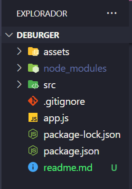
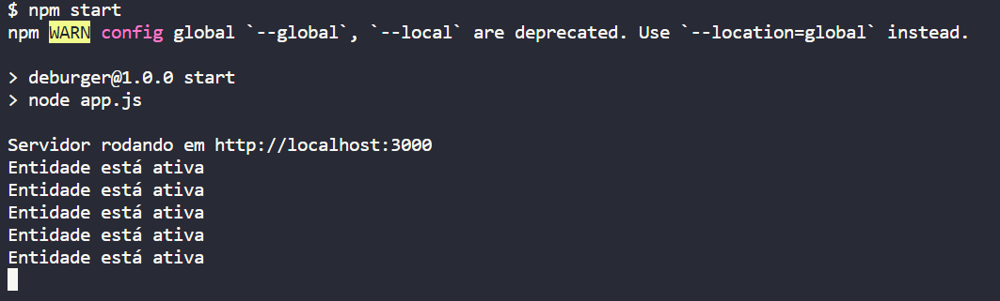

# This.Burger
## API REST

Projeto de conclusão do quarto módulo do curso de Web Dev. FullStack da Resilia. 
A proposta é a de criar uma aplicação (API) que vai executar todas as ações do CRUD (Create, Read, Update, Delete) utilizando o padrão REST dos verbos HTTP. 
A aplicação foi desenvolvida em Node.js juntamente com Express.

## 🚀 Começando

Essas instruções permitirão que você obtenha uma cópia do projeto em operação na sua máquina local para consumir a API.

Consulte **Executando a aplicação** para saber como utilizar o projeto.

### 📋 Pré-requisitos

O que você precisa para instalar o software e como instalá-lo?

```
Node.js Versão 16.15.1 (Que no momento é a versão LTS)
Express (Biblioteca utilizada no Node).
```

### 🔧 Instalação

Uma série de exemplos passo-a-passo que informam o que você deve executar para ter um ambiente de desenvolvimento em execução.

**Instalação do Node e Express:**


***Windows:***


Você pode baixar direto pelo site: [node](https://nodejs.org/en/)

Ou então via Chocolatey:
```
choco install nodejs-lts
```

***Mac:***

Você pode baixar direto pelo site: [node](https://nodejs.org/en/)

***Linux*** 

via apt e snap:

```
sudo apt-get install curl

curl -fsSL https://deb.nodesource.com/setup_lts.x | sudo -E bash -

sudo apt-get install -y nodejs
```

Após a instalação do Node utilizaremos os comandos do NPM (Node Package Manager) no terminal para instalar a biblioteca Express:

```
npm i express
```
Após a instalação você ele deve ter baixado uma pasta chamada node_modules conforme abaixo:




#### Instralação da ferramenta Insomnia (utilizada para testar as rotas da API):

***Windows:***

Você pode baixar pelo site: [Insomnia](https://insomnia.rest/download)

ou então via Chocolatey
```
choco install insomnia-rest-api-client
```
***Mac:***

via brew:
```
brew install --cask insomnia
```

***Linux:***

via snap:
```
snap install insomnia
```


## ⚙️ Executando a aplicação


Para executar o teste você deve inserir o comando start do npm:

```
npm start
```
então irá aparecer no terminal a mennsagem que o servidor está rodando com o link para acesso das rotas, o comando de post deve ser executado na rota /create e o comando get deve ser rodado na rota /tips

Exemplo de como devem ser executados os comandos: 



Para acessar alguma das entidades deve-se acessar a rota correspondente (ex.: para acessar a entidade cardápio, coloque o complemento "/cardapio" ao final do link: http://localhost:3000/cardapio) e passar um objeto JSON conforme abaixo:

**ATENÇÃO: Não se esqueça da vírgula entre um atributo e outro. O último atributo não deve conter vírgula.**


### Entidade Cardapio: 

Acessar pela rota: http://localhost:3000/cardapio

Modelo do corpo da requisição: 
``` 
    {
        "nomeItem" : "nome item",
        "ingredientes" : "exemplo ingredientes",
        "preco" : "00.0"
    }

    Exemplo:
    {
        "nomeItem" : "x-bug",
        "ingredientes" : "pao, hamburguer e queijo",
        "preco" : "10.90"
    }

```

### Entidade Cliente: 

Acessar pela rota: http://localhost:3000/clientes

Modelo do corpo da requisição: 
``` 
    {
        "nome" : "nome cliente",
        "endereco" : "rua exemplo",
        "formaDePagamento" : "pix",
        "cpf" : "12345678910",
        "telefone" : "12345678910",
        "email" : "email.cliente@exemplo.com"
    }

    Exemplo:
    {
        "nome" : "José das Couves",
        "endereco" : "rua das hortalicias 47",
        "formaDePagamento" : "pix",
        "cpf" : "12345678910",
        "telefone" : "12345678910",
        "email" : "jose.couves@gmail.com"
    }

```
### Entidade Estoque: 

Acessar pela rota: http://localhost:3000/estoque

Modelo do corpo da requisição: 
``` 
    {
        "nomeIngrediente" : "nome ingrediente",
        "quantidadeIngrediente" : "00",
        "fornecedorIngrediente" : "nome fornecedor"
    }

    Exemplo:
    {
        "nomeIngrediente" : "pao",
        "quantidadeIngrediente" : "10",
        "fornecedorIngrediente" : "padoca"
    }

```
### Entidade Fornecedor: 

Acessar pela rota: http://localhost:3000/fornecedor

Modelo do corpo da requisição: 
``` 
    {
        "nomeFornecedor" : "nome fornecedor",
        "taxa" : "00",
        "endereco" : "rua fornecedor",
        "item" : "nome item",
        "telefone" : "12345678910",
        "cnpj" : "12345678000111"
    }

    Exemplo:
    {
       "nomeFornecedor" : "padoca",
        "taxa" : "15",
        "endereco" : "rua do pao 50",
        "item" : "pao",
        "telefone" : "12345678910",
        "cnpj" : "12345678000111"
    }

```
### Entidade Fornecedor: 

Acessar pela rota: http://localhost:3000/fornecedor

Modelo do corpo da requisição: 
``` 
    {
        "idCliente" : "id cliente",
        "itensPedido" : "exemplo item",
        "quantidadeItens" : "00",
        "totalPedido" : "00"
    }

    Exemplo:
    {
       "idCliente" : "03",
        "itensPedido" : "x-bug",
        "quantidadeItens" : "01",
        "totalPedido" : "10.99"
    }

```


Depois acesse a rota e escolha o método para cada uma das ações do CRUD

**Método GET**

O método GET pode ser utilizado de duas maneiras:

1. Selecionar todas as informações do banco. Para isso utilize o método GET na rota da entidade escolhida.
Ex.: http://localhost:3000/clientes

2. Selecionar apenas uma informação filtrada pelo ID. Para isso complemente o link da rota com "/id".
Ex.: http://localhost:3000/clientes/1


**Método POST**

No método POST você deve preencher o corpo da requisição conforme descrito acima e utilizar a rota na entidade escolhida.
Ex.: http://localhost:3000/clientes

Se as informações passadas no corpo da requisição passarem na validação ele irá criar um novo item dentro da entidade escolhida com um id único, gerado automáticamente.


**Método PUT**

No método PUT você deve preencher o corpo da requisição conforme descrito acima e utilizar a rota na entidade escolhida complementando com "/id".

Ex.: http://localhost:3000/clientes/1

Se as informações passadas no corpo da requisição passarem na validação ele irá alterar o item dentro da entidade escolhida com o id único passado na rota.


**Método DELETE**

No método DELETE você deve utilizar a rota na entidade escolhida complementando com "/id".

Ex.: http://localhost:3000/clientes/1

Ele irá deletar o item dentro da entidade escolhida com o id único passado na rota.


**Finalizando**

Quando terminar de utilizar a aplicação você irá precisar derrubar o servidor e liberar o terminal. Para isso é só utilizar o comando:
```
ctrl + c
```


## 🛠️ Construído com

Ferramentas utilizadas:

* [Express](https://expressjs.com/pt-br/guide/routing.html)
* [Node](https://nodejs.org/en/docs/)

## ✒️ Autores

Projeto desenvolvido em conjunto pelo Squad 1:

* **Fernando Patrick** - *Gestor de Conhecimento* - [FernandoPatrick](https://github.com/FernandoPatrick)
* **Flávio Christovam** - *Desenvolvedor* - [fchristovam](https://github.com/fchristovam)
* **João Paulo** - *Desenvolvedor* - [Joao-P-G-Begiato](https://github.com/Joao-P-G-Begiato)
* **Lucas Passos** - *Gestor de Gente* - [LucasBinho](https://github.com/LucasBinho)
* **Rafael Jordão** - *Co-Facilitador* - [rafaelljordao](https://github.com/rafaelljordao)

## 📄 Licença

Este projeto está sob a licença MIT - veja o arquivo [LICENSE](https://github.com/Joao-P-G-Begiato/deburger/blob/main/LICENSE) para detalhes.


## 🎁 Expressões de gratidão

* Aos colegas desenvolvedores que participaram desse projeto (listados acima).
* Aos facilitadores Tech Jarom Aidukaitis e Leonardo Costa que nos acolheram nesse universo.
* A facilitadora Anna Caroline Souza que nos deu força nos momentos mais tortuosos dessa jornada.

--- -->